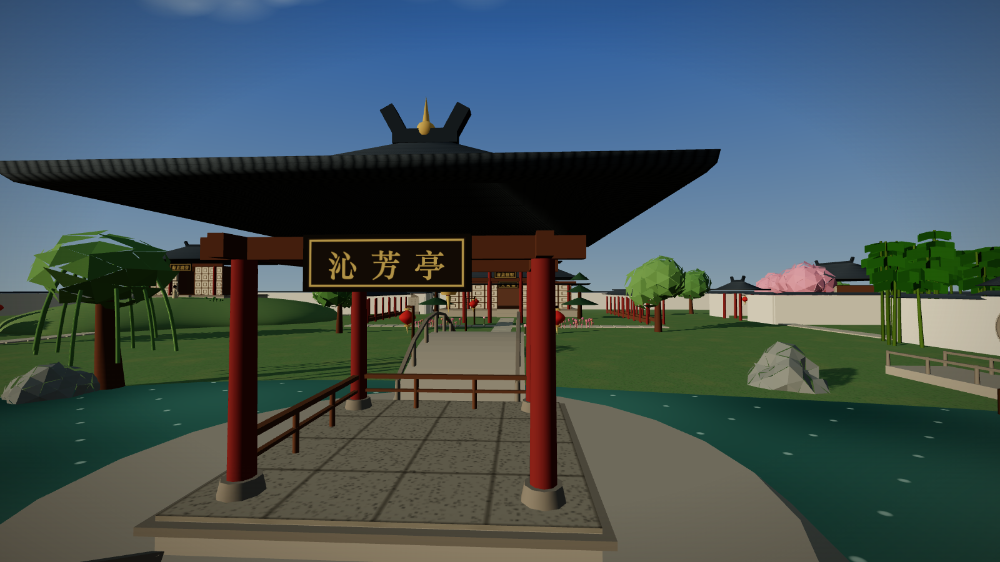
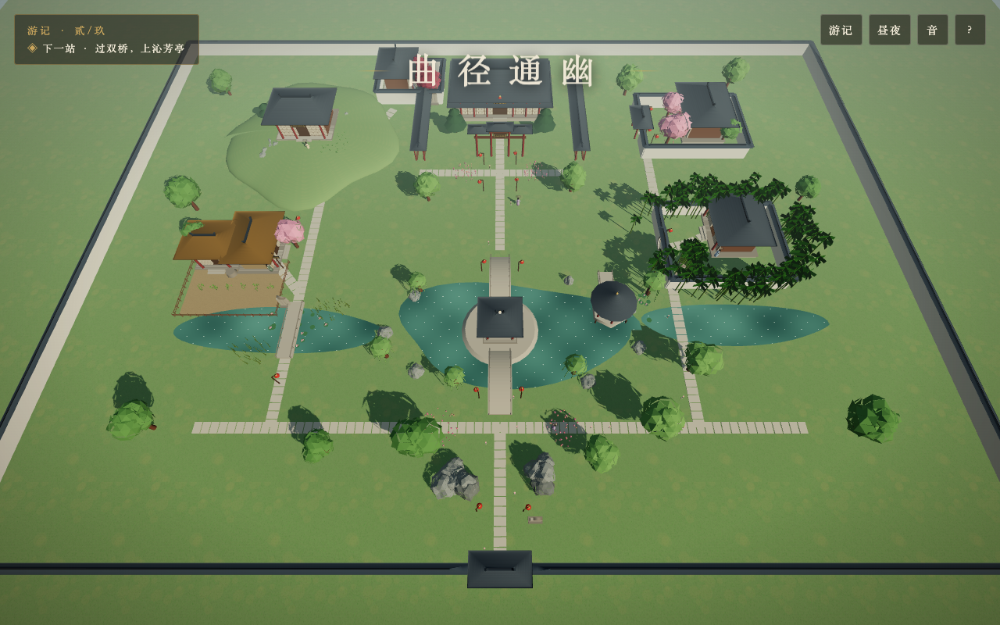
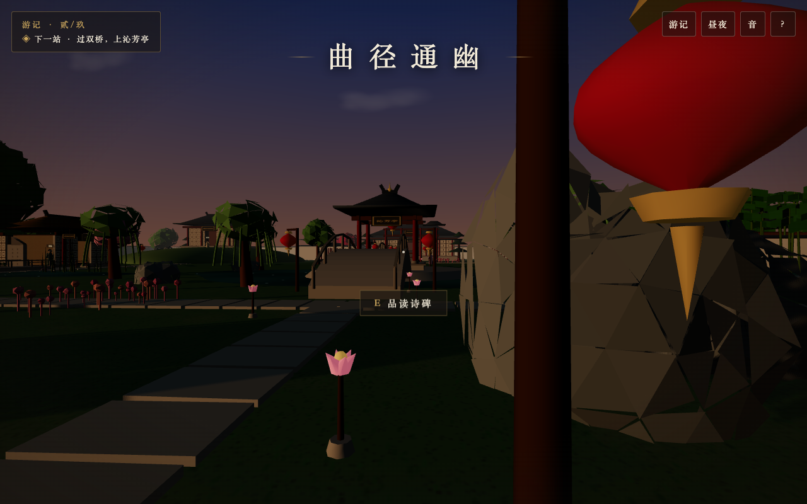
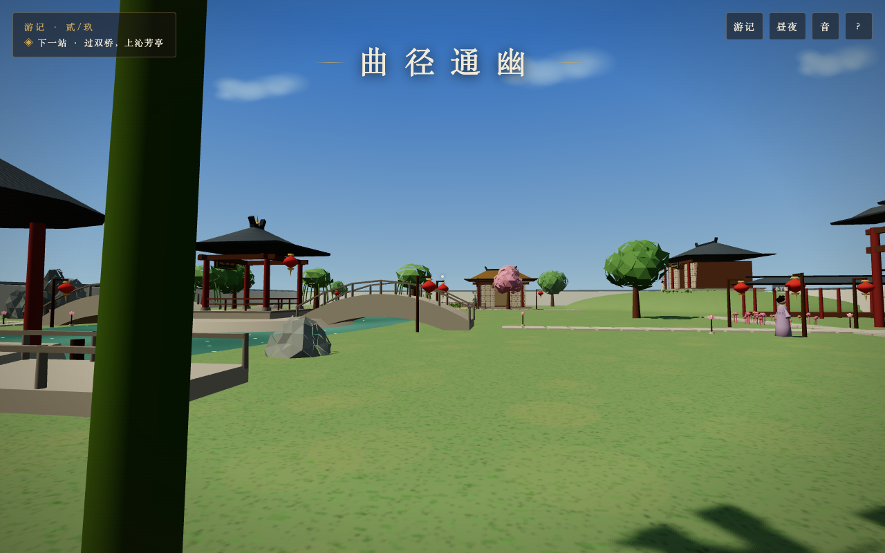
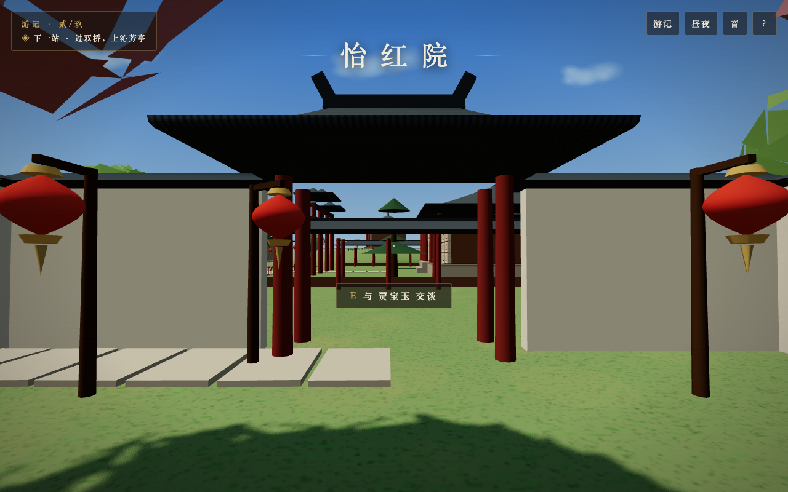
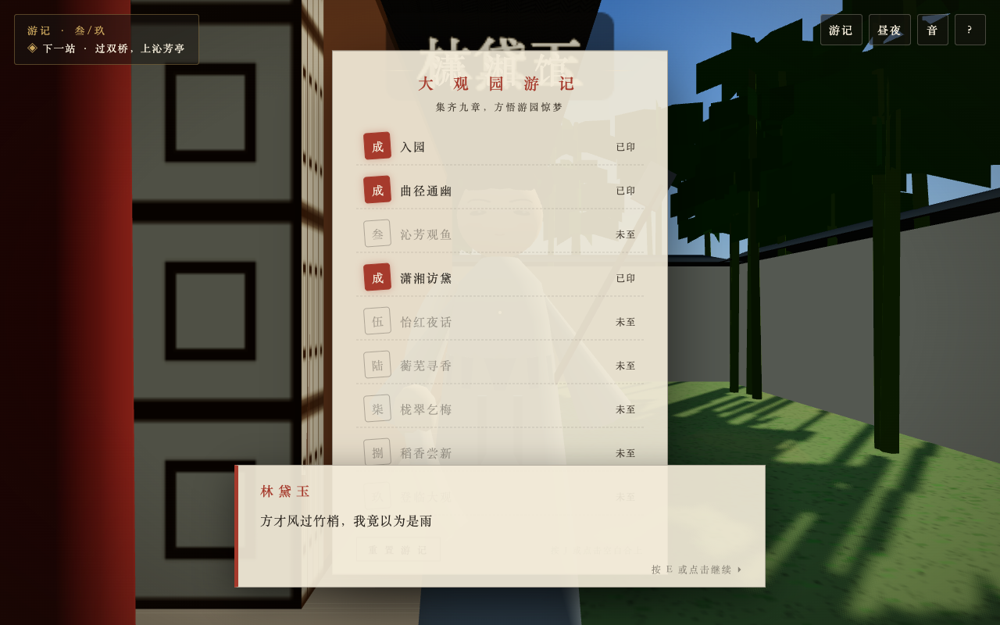
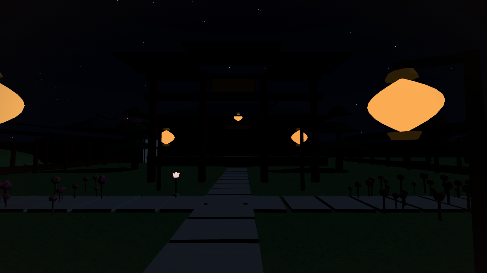

# 大观园 · 入画

《红楼梦》大观园沉浸式 3D 游园体验——纯浏览器运行的第一人称国风园林。
所有建筑、山水、人物、音乐均为程序化生成，**零外部资源文件**。

## 在线体验

**[点击进入大观园 →](https://juicyzhou.github.io/grand-view-garden/)**

桌面与手机浏览器均可直接游园，无需安装任何东西。



## 园中一瞥

|  |  |
| :---: | :---: |
|  |  |
| 全园俯瞰 · 八景环池而布 | 引路莲花灯 · 随主线明灭 |
|  |  |
| 潇湘馆月洞门 · 竹径通厅 | 贾宝玉 · 金冠抹额通灵玉 |
|  |  |
| 游记九章 · 朱砂集章 | 省亲别墅 · 灯火夜色 |

## 特色

- **大观园八景**：沁芳亭（池心洲双桥）、潇湘馆（竹林月门）、怡红院（海棠红灯）、蘅芜苑（土山湖石）、稻香村（竹篱茅舍）、栊翠庵（红梅）、藕香榭与蓼汀花溆（临水莲浦）、大观楼·省亲别墅（重檐正殿与牌坊）
- **「大观园游记」九章主线**：入园、曲径通幽、沁芳观鱼、潇湘访黛、怡红夜话、蘅芜寻香、栊翠乞梅、稻香尝新、登临大观——目标追踪常驻指引，游记册集朱砂印章，进度自动存档
- **红楼人物**：黛玉垂鬟罥烟眉、宝玉金冠通灵玉、宝钗圆髻金锁、妙玉尼帽拂尘、李纨素髻——各有专属发型、眉眼与佩饰，近身攀谈（打字机对话）
- **昼夜循环**：日/夜自动轮转、晚霞过渡、星月升落、灯笼与引路花灯入夜自明
- **生成式音乐**：谱曲《游园引》——Karplus-Strong 合成古筝演奏起承转合五声旋律，摇指/滑音/泛音/刮奏诸技法；滤波风声、正弦鸟鸣
- **第一人称漫游**：行走/疾行/跳跃，拱桥、台阶、土山皆为可行走真实地形；新手引导与引路花灯相伴
- **诗碑品读**：《葬花吟》《访妙玉乞红梅》《杏帘在望》《曲径通幽》四通诗碑

## 操作

| 按键 | 作用 |
| --- | --- |
| `W A S D` | 行走 |
| `Shift` | 疾行 |
| `空格` | 跳跃 |
| `E` | 与人物交谈 / 品读诗碑 |
| `J` | 展开游记册（集章进度） |
| 鼠标 | 环视（点击画面锁定指针） |
| `Esc` | 释放鼠标 |

移动端：左侧虚拟摇杆行走，右侧滑动环视，点按文本框推进对话，触屏按钮交谈/跳跃。

## 本地开发

```bash
npm install
npm run dev
# 打开 http://localhost:5173/
```

生产构建：

```bash
npm run build    # 产物在 dist/，任意静态服务器可托管
npm run preview  # 本地预览构建产物
```

推送 `main` 分支即由 GitHub Actions 自动构建并部署到 GitHub Pages。

## 技术要点

- **Three.js (WebGL)**，无引擎、无构建期资源
- **程序化中式建筑**：举折曲面屋顶 + 翼角起翘参数化生成（`src/world/architecture.js`）
- **昼夜循环**：太阳/月光轨道、晚霞过渡、星月、灯笼自发光（`src/core/engine.js`）
- **生成式音乐**：谱曲式古筝（摇指/滑音/刮奏）+ 环境风声鸟鸣（`src/core/audio.js`）
- **碰撞与地形**：圆/盒碰撞体 + 函数地面（桥拱、台阶、土山余弦坡）（`src/core/player.js`、`src/world/garden.js`）
- **任务系统**：九章游记状态机 + localStorage 持久化（`src/ui/quest.js`）
- **实例化渲染**：竹林、花丛、苇草、甬路石板（InstancedMesh）
- **Canvas 程序化纹理**：瓦垄、窗棂、草地、匾额、诗碑、人物面容

## 目录结构

```
src/
├── main.js               # 装配与主循环
├── core/
│   ├── engine.js         # 渲染器 / 天空 / 昼夜
│   ├── player.js         # 第一人称控制 / 碰撞
│   └── audio.js          # 生成式音频
├── world/
│   ├── materials.js      # 调色板 / Canvas 纹理
│   ├── architecture.js   # 屋顶 / 亭 / 厅 / 廊 / 墙 / 桥
│   ├── nature.js         # 竹 / 树 / 山 / 水 / 莲
│   ├── garden.js         # 大观园总体布局
│   └── npc.js            # 红楼人物与对话
└── ui/
    ├── hud.js            # 标题 / HUD / 对话 / 引导 / 游记册
    └── quest.js          # 九章游记任务系统

scripts/
├── smoke.mjs             # 无头浏览器冒烟测试
├── tour.mjs              # 各景点巡回截图
└── interact-test.mjs     # 交互与任务端到端测试
```

## 测试

需本机安装 Chrome。先启动 `npm run dev`，然后：

```bash
node scripts/smoke.mjs          # 加载/入画/行走/昼夜
node scripts/tour.mjs           # 各景点截图到 scripts/
node scripts/interact-test.mjs  # 对话、诗碑与任务断言
```

## 版本

当前版本与迭代历史见 [CHANGELOG.md](CHANGELOG.md)（语义化版本：小修改迭代修订号，功能迭代小版本，重大修改大版本）。
