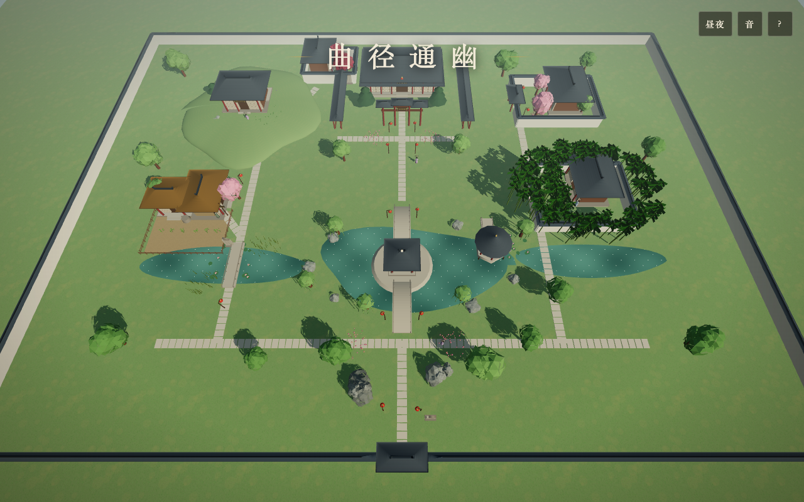

# 大观园 · 入画

《红楼梦》大观园沉浸式 3D 游园体验——纯浏览器运行的第一人称国风园林。
所有建筑、山水、人物、音乐均为程序化生成，**零外部资源文件**。



## 快速开始

```bash
npm install
npm run dev
# 打开 http://localhost:5173/
```

生产构建：

```bash
npm run build    # 产物在 dist/，任意静态服务器可托管
npm run preview  # 本地预览构建产物
```

## 操作

| 按键 | 作用 |
| --- | --- |
| `W A S D` | 行走 |
| `Shift` | 疾行 |
| `空格` | 跳跃 |
| `E` | 与人物交谈 / 品读诗碑 |
| 鼠标 | 环视（点击画面锁定指针） |
| `Esc` | 释放鼠标 |

移动端：左侧虚拟摇杆行走，右侧滑动环视，屏幕按钮交谈/跳跃。

## 园中景致

- **沁芳亭** —— 池心洲上，南北双拱桥相连，荷风四面
- **潇湘馆** —— 千百竿翠竹环合，黛玉临竹而立，《葬花吟》诗碑在侧
- **怡红院** —— 海棠盛开，红灯高挂，宝玉相待
- **蘅芜苑** —— 土山之上，湖石罗列，宝钗居焉
- **稻香村** —— 竹篱茅舍、春韭田畦、杏帘在望
- **栊翠庵** —— 红梅映雪，妙玉煎茶
- **藕香榭 / 蓼汀花溆** —— 临水亭榭，莲浦菱歌
- **大观楼 · 省亲别墅** —— 北园正殿，重檐牌坊

## 技术要点

- **Three.js (WebGL)**，无引擎、无构建期资源
- **程序化中式建筑**：举折曲面屋顶 + 翼角起翘参数化生成（`src/world/architecture.js`）
- **昼夜循环**：太阳/月光轨道、晚霞过渡、星月、灯笼自发光（`src/core/engine.js`）
- **生成式音乐**：Karplus-Strong 拨弦合成古筝，五声音阶行吟 + 刮奏；滤波噪声作风、正弦扫频作鸟（`src/core/audio.js`）
- **碰撞与地形**：圆/盒碰撞体 + 函数地面（桥拱、台阶、土山余弦坡）（`src/core/player.js`、`src/world/garden.js`）
- **实例化渲染**：竹林、花丛、苇草、甬路石板（InstancedMesh）
- **Canvas 程序化纹理**：瓦垄、窗棂、草地、匾额、诗碑

## 目录结构

```
src/
├── main.js               # 装配与主循环
├── core/
│   ├── engine.js         # 渲染器 / 天空 / 昼夜
│   ├── player.js         # 第一人称控制 / 碰撞
│   └── audio.js          # 生成式音频
├── world/
│   ├── materials.js      # 调色板 / Canvas 纹理
│   ├── architecture.js   # 屋顶 / 亭 / 厅 / 廊 / 墙 / 桥
│   ├── nature.js         # 竹 / 树 / 山 / 水 / 莲
│   ├── garden.js         # 大观园总体布局
│   └── npc.js            # 红楼人物与对话
└── ui/
    └── hud.js            # 标题 / HUD / 对话 / 诗碑

scripts/
├── smoke.mjs             # 无头浏览器冒烟测试
├── tour.mjs              # 各景点巡回截图
└── interact-test.mjs     # 交互端到端测试
```

## 测试

需本机安装 Chrome。先启动 `npm run dev`，然后：

```bash
node scripts/smoke.mjs          # 加载/入画/行走/昼夜
node scripts/tour.mjs           # 各景点截图到 scripts/
node scripts/interact-test.mjs  # 对话与诗碑交互
```
